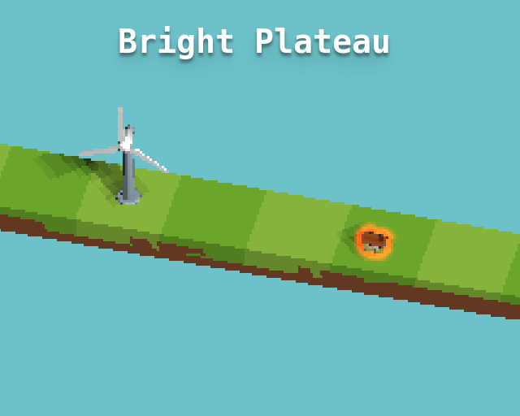

# Bright Plateau

A puzzle game about powering up houses.

A game made for the [Ludum Dare 39 Jam][].  You can [play it in your browser][].

By [merwaaan][] and myself, with great support from [Marie-Donnie][].

## Tools used

- [THREE.js][]
- [Playground.js][]
- [Blender][]
- [Sunvox][]
- [Sfxr][]

[Ludum Dare 39 Jam]: https://ldjam.com/events/ludum-dare/39
[play it in your browser]: http://0xc0de.fr/ld39
[THREE.js]: https://github.com/mrdoob/three.js
[Playground.js]: http://playgroundjs.com/
[Aseprite]: http://www.aseprite.org/
[Sunvox]: http://www.warmplace.ru/soft/sunvox/
[Blender]: https://www.blender.org/
[Sfxr]: http://www.drpetter.se/project_sfxr.html
[merwaaan]: https://github.com/merwaaan
[Marie-Donnie]: https://github.com/Marie-Donnie
